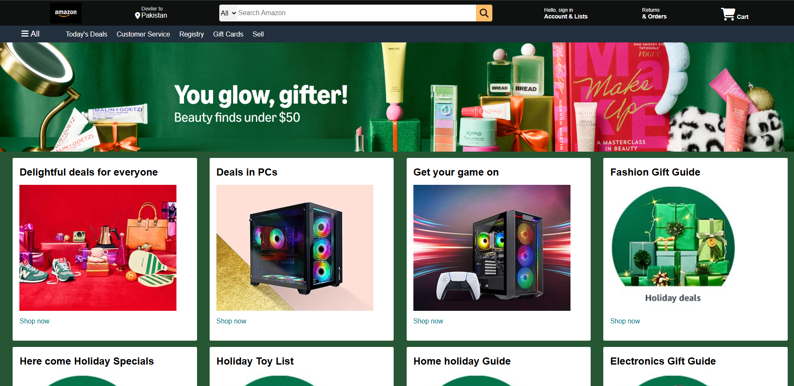

# Amazon Homepage Clone

A static, front-end clone of the Amazon homepage built to demonstrate layout structuring using HTML and CSS. This project focuses on recreating the iconic Amazon navigation bar, hero banner, product grid, and the comprehensive footer section.

## 🚀 Key Features

- **Complex Navigation Bar:** Replicates Amazon's detailed header, including the logo, location delivery selection, categorized search bar, account sign-in, orders, and a shopping cart with FontAwesome icons.
- **Secondary Panel:** A secondary navigation bar for quick links like "Today's Deals", "Customer Service", and "Registry".
- **Dynamic Grid Layout:** Uses CSS Flexbox (`flex-wrap: wrap`) to create a responsive-like grid of product recommendation cards displaying images and "Shop now" links.
- **Hero Banner:** A full-width promotional banner image (`hero-image.jpg`).
- **Comprehensive Footer:** A multi-paneled footer featuring categorized links ("Get to Know Us", "Make Money with Us", etc.), a "Back to top" button, and legal/copyright information.

## 📂 Project Structure

- `index.html`: Contains all the semantic HTML layout for the header, main content grids, and footer.
- `style.css`: Contains CSS rules, utilizing Flexbox for layout alignment, hover effects, and positioning.
- **Assets:** Included product box images (`box-image1.jpg` to `box-image8.jpg`), main banner (`hero-image.jpg`), and the Amazon logo (`amazon_logo.png`).

## 🛠️ Technologies Used

- **HTML5:** Semantic grouping of elements and page structure.
- **CSS3:** Styling, Flexbox routing, hover states, and background images.
- **FontAwesome:** For intuitive navigation icons.

## 💡 How to Run locally

Since this project consists of plain HTML and CSS, it requires no installation or build steps.

1. Clone or download the source code folder.
2. Ensure you have the images in the same path.
3. Open the `index.html` file in any modern web browser to see the result.

## 👤 Author
Developed as a CSS layout practice project.
